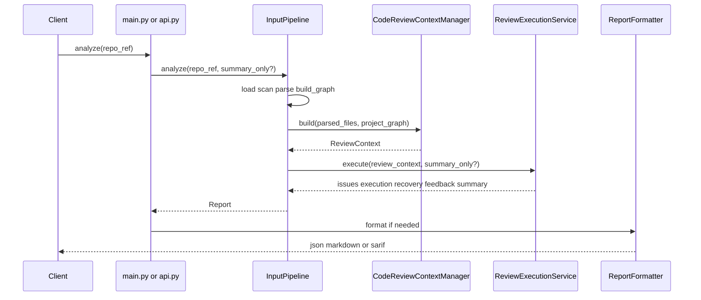

# 架构文档

## 概述

Code Review Agent 是一个针对源代码仓库的静态分析与审查系统。它接收本地路径或远程 Git 仓库，生成统一结构的审查报告，并通过 CLI 或 HTTP API 暴露结果。

系统的核心价值在于把多个阶段的处理结果统一到一个 `Report` 模型中。输入阶段负责仓库加载、文件筛选、解析与依赖图生成；上下文阶段负责增量状态、关键文件和预算估算；控制阶段负责按 DAG 并发执行多类审查 agent；反馈阶段负责去重、摘要和验证信息整理；输出阶段负责 JSON、Markdown 和 SARIF 三种格式。

轻量 summary 路径是当前实现中的一个重要分支。它在输入、上下文和执行阶段都执行裁剪，只保留更小的结果集和必要统计信息，适合快速评估仓库质量或为上层系统提供摘要视图。

## 技术栈

**语言与运行时**
- Python 3

**主要库**
- `fastapi`: HTTP API
- `uvicorn`: API 服务运行
- `pydantic` / `pydantic-settings`: 配置与统一数据模型
- `GitPython`: 仓库能力中的异常类型支持

**测试**
- `pytest`

**输出协议**
- JSON
- Markdown
- SARIF 2.1.0

## 项目结构

```text
workspace/
├── main.py
├── config/
│   └── default.json
├── src/
│   ├── api.py
│   ├── report_processing.py
│   ├── agents/
│   ├── common/
│   ├── context/
│   ├── control/
│   ├── feedback/
│   ├── input/
│   ├── output/
│   └── recovery/
└── tests/
    ├── test_agents.py
    ├── test_api.py
    ├── test_control.py
    ├── test_feedback.py
    ├── test_input_pipeline.py
    ├── test_main.py
    ├── test_output.py
    ├── test_recovery.py
    └── test_report_processing.py
```

**入口点**
- `main.py`: CLI 入口与 API 启动入口
- `src/api.py`: FastAPI 应用工厂与请求模型
- `src/input/service.py`: 仓库到 `Report` 的主分析入口

## 子系统

### 输入子系统
**目的**: 将仓库输入转换为可审查的结构化文件集。
**位置**: `src/input/`
**关键文件**: `service.py`, `repo_loader.py`, `scanner.py`, `parser.py`, `dependency_extractor.py`
**职责**: 加载本地或远程仓库、执行文件过滤、解析 Python 结构、构建依赖图、编排输入阶段主流程。

### 上下文子系统
**目的**: 为后续 agent 执行构建统一审查上下文。
**位置**: `src/context/`
**关键文件**: `manager.py`, `history.py`
**职责**: 生成 `ReviewContext`、估算预算、识别关键文件、计算增量状态、持久化历史 fingerprint。

### 控制与执行子系统
**目的**: 按依赖顺序并发执行审查任务。
**位置**: `src/control/`
**关键文件**: `plan.py`, `scheduler.py`, `service.py`
**职责**: 生成 `CodeReviewPlan`、调度 agent、聚合执行结果、区分完整模式与 summary 模式。

### Agent 子系统
**目的**: 承载具体规则和审查逻辑。
**位置**: `src/agents/`
**关键文件**: `base.py`, `structure.py`, `security.py`, `style.py`, `performance.py`, `test.py`
**职责**: 读取上下文并产出 `Issue`，同时共享文件内容和 AST 缓存。

### 反馈与恢复子系统
**目的**: 处理结果收敛、历史去重、验证和故障降级。
**位置**: `src/feedback/`, `src/recovery/`
**关键文件**: `service.py`, `circuit_breaker.py`
**职责**: 过滤历史问题、回写 issue、生成 summary、生成恢复事件与熔断状态。

### 暴露与输出子系统
**目的**: 将统一报告转换为可消费接口。
**位置**: `src/api.py`, `src/output/`, `src/report_processing.py`
**关键文件**: `api.py`, `formatter.py`, `sarif.py`, `report_processing.py`
**职责**: HTTP 接口、CLI 过滤/裁剪/summary 复用、JSON/Markdown/SARIF 格式化。

## 执行流程

```mermaid
flowchart LR
    RepoRef["repo_ref or local path"] --> Loader["RepoLoader"]
    Loader --> Scanner["RepositoryScanner"]
    Scanner --> Parser["CodeParser"]
    Parser --> Graph["DependencyExtractor"]
    Graph --> Context["CodeReviewContextManager"]
    Context --> Execute["ReviewExecutionService"]
    Execute --> Scheduler["TaskScheduler"]
    Scheduler --> Agents["structure security style performance test"]
    Agents --> Feedback["CodeReviewFeedbackService"]
    Feedback --> Report["Report / ReportSummary"]
    Report --> Output["CLI or FastAPI or SARIF"]
```



## 请求时序



## 关键设计决策

### 统一数据契约
所有入口和输出都围绕 `src/common/schemas.py` 中的数据模型实现。这样 CLI、API、SARIF、历史持久化和 summary 逻辑共享同一套结构，减少分叉。

### 轻量 summary 执行路径
`summary_only=True` 会触发多处裁剪：输入阶段隐藏大字段、上下文阶段移除关键文件与依赖焦点、执行阶段仅运行较小 agent 集合，并跳过反馈与恢复的大部分扩展信息。

### 有界共享缓存
`BaseReviewAgent` 维护仓库级文件内容和 Python AST 缓存，并提供指标统计与上限控制。输入阶段会在每次分析前设置上限、清理仓库缓存、重置指标，保证长期服务运行时的内存边界可控。

### 增量审查与历史去重
历史状态通过 `.code-review-history.json` 保存，记录文件内容 hash 和历史 issue fingerprint。反馈层会基于 fingerprint 过滤历史问题，默认只报告新增 issue。

### 审查顺序与依赖
任务计划使用显式 DAG 表达。完整模式默认顺序是 `structure -> security/style/performance/test`，summary 模式默认顺序是 `structure -> security/test`。`structure` 作为前置任务，为后续 agent 提供更稳定的文件结构信息。
